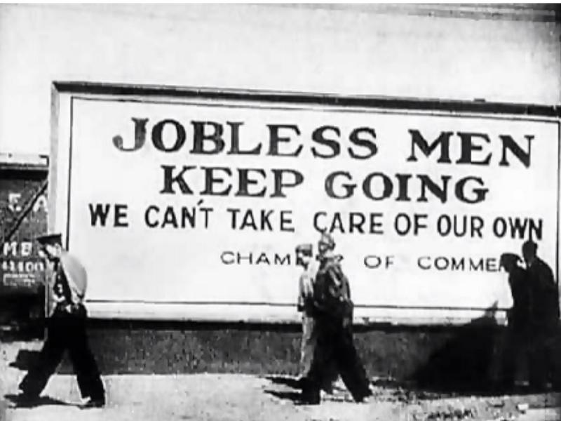

# Confronting a Crisis: An Exploratory Textual Analysis of the The Great Depression From Hoover to FDR 
Student: Juliana Torres, julianatorres@berkeley.edu

## About Me:
I am a historian-in-training at UC Berkeley, and I am interested in Public History and the History of Ideas. I want to use the tools of Digital Humanities to research, analyze, and share interesting data about how ideas become popular. For this project, more specifically, I want to see if there is evidence of how America embarked on the New Deal mindset. 

## Abstract
This Python project was an exploratory data analysis of the presidental communication during the Great Depression, seeking to identify a linguistic change from Hoover's classical liberalism to FDR's New Deal. For this research I used Python on Google Collab, and a number of other tools and methods to explore word frequency, common expressions in n-grams, topic modelling and sentiment analysis of the text. I was particularly interested in learning the language around words like "Government" and "American people," and the usage of direct language addressing the population, versus language addressing business or financial institutions. My expectation was to find a stark difference in tone, vocabulary and sentiment between both presidents, but the results showed a stark similarity between them, expect in the direction of their speeches. While FDR mentioned New Deal solutions and hoped for a recreation of trust, Hoover spoke of business loans and tariffs. This small, but significant difference in their vocabulary will guide the next steps of my research, where I will use NER to identify the connections among these entities and characters. 

## From Liberalism to the New Deal in Language
When FDR became president in 1933, he encountered a nation that had nosedived into despair. The Great Depression was entering its fourth year, and the unemployment rate was at 24.9%, the highest in the country's history. Around 26,000 businesses failed. Stock prices plummeted. It transformed American life.

His predecessor Herbert Hoover had been elected only one year before the market crash. A classic liberal, Hoover believed that economic downturns were part of a capitalist economy and were to be expected. As he said in a speech in 1931, government assistance weakened the American character. Hoover hoped that the solution to the Depression would come from voluntary aid and "associational action" by community members and business people and by maintaining a positive mind frame, often making public statements that "the tide had turned." In the eyes of many Americans, President Hoover's response seemed inadequate and uncaring. His nineteen-century approach to Liberalism no longer served the nation's needs, and FDR's New Deal marked the beginning of a new relationship between Americans and their government. 

My project seeks to find linguist evidence of this sentimental shift between Hoover's Liberalism and FDR's New Deal. I want to do so by analyzing FDR's Fireside Chats, a series of 27 speeches transmitted by radio where the president communicated directly with the people, and Hoover's speeches from the start of the Depression until he leaves office. By analyzing the most frequently used words, sentiment, and topics of the speeches, I hope to find what made one so comforting while the other seemed so out of touch.  

----
## Dataset
For this analysis I will use 19 speeches given by Herbert Hoover from October 25th 1929 until December 6th, 1932. To get more relevant results related to the Great Depression, I have excluded speeches dealing with unrelated topics (foreign policy, for example). For FDR’s analysis, I will use 13 of his Fireside Chats, the first given on May 12, 1933 and the last on September 3, 1939 at the end of the Second New Deal. I have chosen the Fireside Chats for their intimate tone and uniqueness. 
